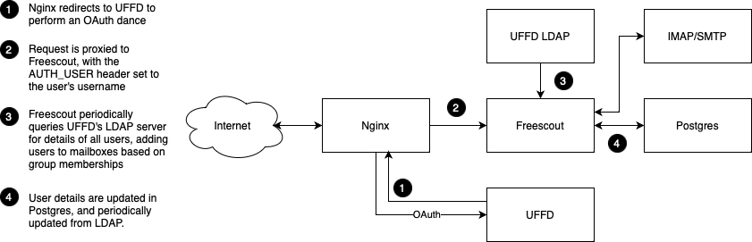

# EMF Freescout Config

This repository contains the configuration for [EMF](https://emfcamp.org)'s
[Freescout](https://freescout.net) setup, which runs in Docker containers, and
makes use of Nginx as a reverse proxy, and [UFFD](https://git.cccv.de/uffd/uffd)
for authentication.

Nginx is (will be) responsible for checking a user is authenticated, and doing an OAuth
dance with UFFD if they're not. Freescout then makes use of UFFD's LDAP server
to obtain user details and assign them to the correct mailboxes, because the
OAuth support in Freescout requires manual admin of mailbox access.

There's also an IMAP & SMTP server somewhere which provides Freescout with
access to the actual emails that are being handled. That's provided by [waves
arms vaguely] something. We'll work that bit out if we get that far.

Here's a pretty picture of how all that fits together:

## Freescale Setup

This all assumes you're running with the default settings from `docker-compose.yml`

1. Log in as admin@example.org with the password `password`.
1. Activate the LDAP module.
2. Go to LDAP settings
   1. LDAP Host: `uffd-ldap`
   2. Port: `389`
   3. Bind DN: `ou=system,dc=example,dc=org`
   4. Bind Username: `service`
   5. Bind Password: `password`
   6. Click "Connect & Fetch Attributes"
   7. Map `mail` to Email, `cn` to First Name, and `sn` to everything else (this is a nasty
      hack taking advantage of UFFD not setting a surname field to allow optional fields to
      be ignored).
   8. DNs and Filters: `dc=example,dc=or(objectclass=person)` to import all users
   9. Toggle Automatic Import on
   10. Toggle Automatic Permission Sync on
   11. Toggle LDAP Authentication on

## Configuring Mailbox Access

Mailbox access can either be manually configured by an admin (not a good idea)
or automatically synchronised via LDAP. To configure via LDAP you need to feed
Freescout a query to find all the relevant users, which will typically look
something like `(&(memberOf=cn=group-name,ou=groups,dc=example,dc=org))`.

Any LDAP query that returns a list of users will work.
