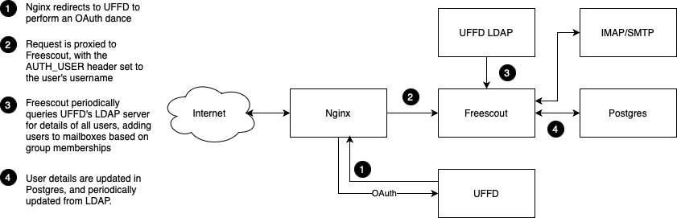

# EMF Freescout Config

This repository contains the configuration for [EMF](https://emfcamp.org)'s
[Freescout](https://freescout.net) setup, which runs in Docker containers, and
makes use of Nginx as a reverse proxy, and [UFFD](https://git.cccv.de/uffd/uffd)
for authentication.

Our protection is now upstream of our Freescout deployment, so isn't contained
here, and makes use of
[uffd-nginxauth](https://git.cccv.de/uffd/uffd-nginxauth) in a separate Nginx
instance, which communicates the authenticated user in the `REMOTE-USER`
header.  The Nginx deployment inside this repo will read this header and pass
the logged in user's username in the `X_AUTH_USER` FastCGI variable to
Freescout.

Freescout regularly queries the UFFD LDAP directory and creates user accounts
for anyone with access, setting access to appropriate mailboxes based on group
memberships.

There's also an IMAP & SMTP server somewhere which provides Freescout with
access to the actual emails that are being handled. That's provided by [waves
arms vaguely] something. We'll work that bit out if we get that far.

Here's a pretty picture of how all that fits together (now outdated):

## Deployment

1. Update the values in `.env` (or set environment variables via some other method)
   to match your actual setup.
2. `docker compose up` to start the necessary services.
3. You'll need a separate proxy instance set up to provide the `REMOTE-USER`
   HTTP header, or provide it yourself for development purposes.
4. You should now be able to access the Freescout instance. Use the default
   username and password from `.env` to log in.
5. Follow the steps in Freescout Setup below.

## Development

`docker compose -f docker-compose.yml -f docker-compose.dev.yml up` will bring
up a stack consisting of the Freescout setup, plus UFFD configured with some
test users. `testadmin / adminpassword` will log you in as an administrator,
`testuser / userpassword` as a standard user.

It will automatically create an OAuth2 client and API client, as long as you don't change
the settings from `.env.example`.

## Freescout Setup

This all assumes you're running with the default settings from `.env.example`. Change them
if you're not.

1. Log in as admin@example.org with the password `freescout`.
2. Activate the LDAP module.
3. Go to LDAP settings
   1. LDAP Host: `uffd-ldapd`
   2. Port: `389`
   3. Bind DN: `ou=system,dc=example,dc=org`
   4. Bind Username: `service`
   5. Bind Password: `$UFFD_LDAP_BIND_PASSWORD` from the .env file
   6. Set the filter to `ou=users,dc=example,dc=org(objectclass=person)`.
   7. Save the settings, or the following step will fail.
   8. Click "Connect & Fetch Attributes"
   9. Map `mail` to Email, `cn` to First Name, and `sn` to everything else (this is a nasty
      hack taking advantage of UFFD not setting a surname field to allow optional fields to
      be ignored).
   10. Toggle Automatic Import on
   11. Toggle LDAP Authentication on
   12. Set $_SERVER key to `X_AUTH_USER`
   13. Set Locate users by to `uid`
   14. Save the settings.
   15. Click `Import Now` and acknowledge.
   16. Toggle Automatic Permission Sync on
   17. Save the settings.
4. Go to Manage -> Users, and grant your own user the Administrator role.

If you delete all your cookies and log back in you should now be dropped straight
in as your authenticated user.

## Configuring Mailbox Access

Mailbox access can either be manually configured by an admin (not a good idea)
or automatically synchronised via LDAP. To configure via LDAP you need to feed
Freescout a query to find all the relevant users, which will typically look
something like `(&(memberOf=cn=group-name,ou=groups,dc=example,dc=org))`.

Any LDAP query that returns a list of users will work.
